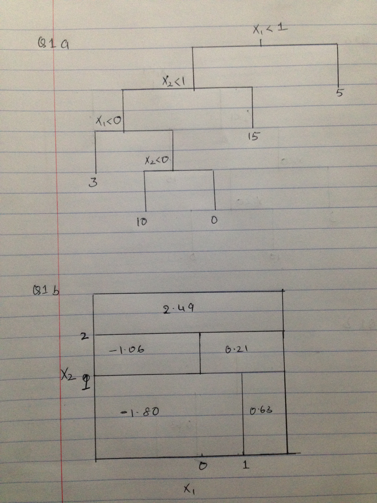

1. Q1.
  + 1a/1b
    
  
  
2. Q2.

  + 2a.
    ```{r}
    X1op=c(3,2,4,1,2,4,4)
    X2op=c(4,2,4,4,1,3,1)
    Yop=c("Red","Red", "Red", "Red", "Blue", "Blue","Blue")
    
    plot(X1op[5:7],X2op[5:7],col="green", xlim=c(0,5), ylim=c(0,5),xlab="X1", ylab="X2", type="p",lwd=6)
    par(new=T)
    plot(X1op[1:4],X2op[1:4],col="red", xlim=c(0,5), ylim=c(0,5),xlab="",ylab="",type="p", lwd=6)
    par(new=F)
    
    ```
  
  + 2b.
    ```{r}
    X1op=c(3,2,4,1,2,4,4)
    X2op=c(4,2,4,4,1,3,1)
    Yop=c("Red","Red", "Red", "Red", "Blue", "Blue","Blue")
    
    plot(X1op[5:7],X2op[5:7],col="blue", xlim=c(0,5), ylim=c(0,5),xlab="X1", ylab="X2", type="p",pch=20)
    par(new=T)
    plot(X1op[1:4],X2op[1:4],col="red", xlim=c(0,5), ylim=c(0,5),xlab="",ylab="",type="p", pch=20)
    par(new=F)
    abline(-0.5,1)
    ```
  
    +     Equation of the hyperplane is $2*X1-2*X2-1=0$
  
  + 2c.
      + Eqn of hyperplane is $2*X1-2*X2-1=0$, so subbing values 
      + Blue (2,1)= 2(2)-2(1)-1= 4-3=1
      + Red (2,2)=2(2)-2(2)-1=4-4-1=-1
      + -> $2*X1-2*X2-1>0$ == Blue
      + -> $2*X1-2*X2-1<0$== Red
  
  + 2d
    + margin is the perpendicular distance from a point to line e.g red point at (2,2) intersects the line at (2.25, 1.75) distance between them is about 0.3
    
    ```{r}
        X1op=c(3,2,4,1,2,4,4)
    X2op=c(4,2,4,4,1,3,1)
    Yop=c("Red","Red", "Red", "Red", "Blue", "Blue","Blue")
    
    plot(X1op[5:7],X2op[5:7],col="blue", xlim=c(0,5), ylim=c(0,5),xlab="X1", ylab="X2", type="p",pch=20)
    par(new=T)
    plot(X1op[1:4],X2op[1:4],col="red", xlim=c(0,5), ylim=c(0,5),xlab="",ylab="",type="p", pch=20)
    par(new=F)
    abline(-0.5,1)
    abline(-1,1,lty=2)
    abline(0,1,lty=2)
    
    ```
  
  + 2e
    ```{r}
        plot(X1op[5:7],X2op[5:7],col="blue", xlim=c(0,5), ylim=c(0,5),xlab="X1", ylab="X2", type="p",pch=20)
    par(new=T)
    plot(X1op[1:4],X2op[1:4],col="red", xlim=c(0,5), ylim=c(0,5),xlab="",ylab="",type="p", pch=20)
    par(new=F)
    abline(-0.5,1)
    abline(-1,1,lty=2)
    abline(0,1,lty=2)
    
    points(2,2,pch=23, lwd=10, col="red")
    points(4,4,pch=23, lwd=10, col="red")
    points(4,3,pch=23, lwd=10, col="blue")
    points(2,1,pch=23, lwd=10, col="blue")
    ```
  
    + Support vectors have been marked with larger points. They are at(2,2),(4,4),(4,3) and (2,1)
  
  + 2f. The 7th point is (4,1) in the blue category. A slight movement of this point will not have an effect on the maximal margin classifer as it would not move within the support vectors of the classifier; However if it moves beyond the margin of the support vectors it will change the hyperplane
  
  + 2g.
    ```{r}
     plot(X1op[5:7],X2op[5:7],col="blue", xlim=c(0,5), ylim=c(0,5),xlab="X1", ylab="X2", type="p",pch=20)
    par(new=T)
    plot(X1op[1:4],X2op[1:4],col="red", xlim=c(0,5), ylim=c(0,5),xlab="",ylab="",type="p", pch=20)
    par(new=F)
    #abline(-0.5,1)
    abline(-0.25,1) 
    ```
  
    + The new hyper plane has the same slope as the original hyperplane but the intercept is a bit larger hence it moves this towards the red points
    
    + Equation of the plane is $2*X1-2*X2-0.5=0$
  
  
  + 2h.
  
    ```{r}
         plot(X1op[5:7],X2op[5:7],col="blue", xlim=c(0,5), ylim=c(0,5),xlab="X1", ylab="X2", type="p",pch=20)
    par(new=T)
    plot(X1op[1:4],X2op[1:4],col="red", xlim=c(0,5), ylim=c(0,5),xlab="",ylab="",type="p", pch=20)
    par(new=F)
    
    points(3.5,2,col="red", pch=20)
    
    ```
  
  
3. Q3.
  + 3a.
    ```{r}
    set.seed(1)
    x=matrix(rnorm(20*3*50),ncol=50)
    x[1:20,1]=x[1:20,1]+3
    x[1:20,2]= x[1:20,2]+3
    x[21:40,1]=x[21:40,1]-4
    x[21:40,2]=x[21:40,2]-4
    x[41:60,2]=x[41:60,2]+3
    x[41:60,1]=x[41:60,1]-4
    plot(x)
    
    y=rep(NA,60)
    y[1:20]=1
    y[21:40]=2
    y[41:60]=3
    ```
  
  + 3b.
    ```{r}
      pr.out=prcomp(x)
      plot(pr.out$x[,1:2],col=1:3, xlab="z1", ylab="z2", pch=20)
    ```
  
  + 3c.
    ```{r}
      set.seed(1)
      km.out=kmeans(x,3,nstart=20)
      table(y,km.out$cluster)
    ```
    + All the cluster points are correctly classified
  
  + 3d.
    ```{r}
      set.seed(1)
      km.out=kmeans(x,2,nstart=20)
      table(y,km.out$cluster)
    ```
    
    +  All the points from class 3 are categorized as points from a class 1.
  
  + 3e.
    ```{r}
      set.seed(1)
      km.out=kmeans(x,4,nstart=20)
      table(y,km.out$cluster)
    ```
  
    + Points from one of the classes are split into two clusters. Points of the remaining clusters are classified correctly
  
  + 3f.
    ```{r}
      set.seed(1)
      km.out=kmeans(pr.out$x[,1:2],3,nstart=20)
      table(y,km.out$cluster)
    ```

    + All the points are classified correctly
    
  + 3g. 
    ```{r}
      set.seed(1)
      km.out=kmeans(scale(x),3,nstart=20)
      table(y,km.out$cluster)
    ```

    + There are more missclassifications compared to 3c; By scaling the points the distance between the points changes and hence it impacts the clustering results.
    
    
4. Q4
  + 4a.
    ```{r}
      require(tree)
      require(randomForest)
      bodyR=load("body.RData")
      plot(Y$Gender,Y$Weight)
      set.seed(1)
      train=sample(507,307)
      test=-train
      X.train=X[train,]
      X.test=X[test,]
      Y.test=Y[test,"Weight"]
      Y.train=Y[train,"Weight"]
      
      bag.body=randomForest(Y.train~.,data=X.train,mtry=21,ntree=50)
      yhat.bag=predict(bag.body, newdata=X[-train,])
      mean((yhat.bag-Y$Weight[-train])^2)
      
      
      rf.body=randomForest(Y$Weight~.,data=X,subset=train,mtry=7,ntree=50)
      yhat.rf=predict(rf.body, newdata=X[-train,])
      mean((yhat.rf-Y$Weight[-train])^2)
      
      plot(c(0,50),c(5,30), type="n", xlab= "# of Trees", ylab="MSE")
      lines(rf.body$mse, col="blue", lwd=2.5)
      lines(bag.body$mse, col="red", lwd=2.5)
      legend(30,30,c("Bagging","Random Forest"))
      lwd=c(2.5,2,5)
      col=c("blue","red")
      legend(30,30,c("Bagging","Random Forest"),lty=c(1,1),lwd=c(2.5,2.5),col=c("red","blue"))
    ```

  + 4b.
    ```{r}
      varImpPlot(rf.body)
      varImpPlot(bag.body)

    ```
  
    + Top 3 variables for randomForest: Waist.Girth, Shoulder.Girth, Chest.Girth
    + Top 3 for bagging: Waist.Girth, Shoulder.Girth and Chest.Girth
    + Same variables are chosen by both methods as most important.
    
    
  
  + 4c.
    ```{r}
      set.seed(1)
      rf.body=randomForest(Y$Weight~.,data=X,subset=train,mtry=7,ntree=500)
      yhat.rf=predict(rf.body, newdata=X[-train,])
      mean((yhat.rf-Y$Weight[-train])^2)
    ```
  
    + In the HW3 Solution, the PLS model had a test error of 8.65, PCR of 9.27, forward stepwise 8.63. The error here is a 9.9, that is bit higher than other methods.
  
  + 4d.
    + The idea of using a smaller subet of 7 from 21 variables is so that we use trees from different variables and that they are  uncorrelated, thus helping us to reduce the variance of the averaged trees. 
    
    + Theorectically there are 21C7 ~116280 ways to select 7 variables from 21 variables. So theoretically adding more trees should give a better estimate.

    + Another practical way is to plot the test data error as a function of number of trees and see if the error improves.

